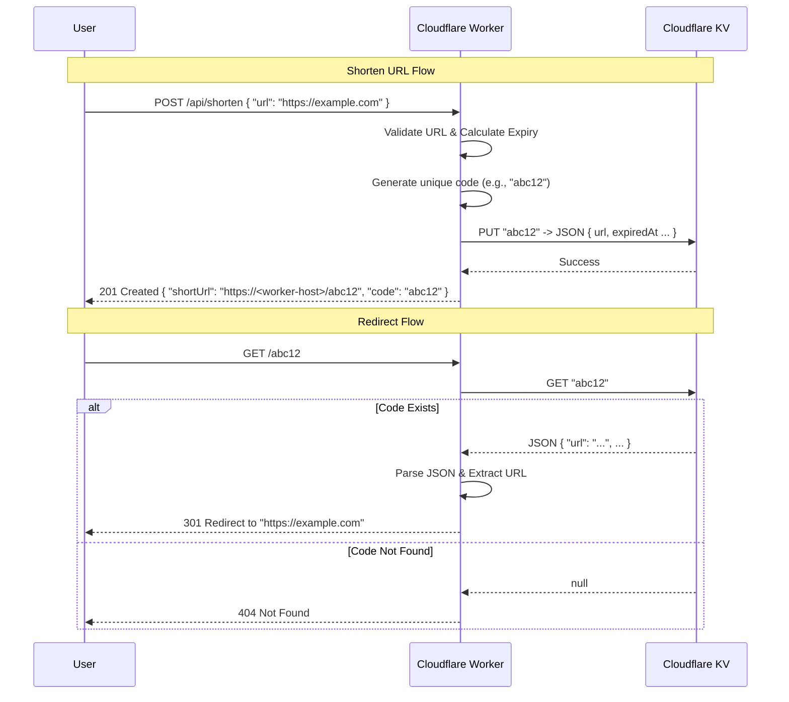

# Architecture: Short URL Generator

This document outlines the architecture for the serverless Short URL Generator, built on the Cloudflare Workers platform.

## Overview

The system is designed to be a high-performance, low-latency URL shortener. It leverages Cloudflare's edge network to handle requests close to the user and uses Cloudflare KV (Key-Value) storage for fast lookups of short codes.

## Technology Stack

- **Runtime**: [Cloudflare Workers](https://workers.cloudflare.com/) (Serverless JavaScript/TypeScript)
- **Language**: TypeScript
- **Routing**: `itty-router` (Tiny, zero-dependency router)
- **Storage**: [Cloudflare KV](https://developers.cloudflare.com/kv/) (Global, low-latency key-value store)
- **Deployment**: `wrangler` CLI

## Components

### 1. The Worker (`src/index.ts`)
The core logic resides in a single Cloudflare Worker. It handles incoming HTTP requests, routes them to the appropriate handler, and manages interactions with the KV store.

### 2. Router
We use `itty-router` to handle API routes. It maps HTTP methods and paths to specific handler functions.

### 3. KV Namespace (`SHORT_URLS`)
A distributed key-value store acting as the database.
- **Key**: The generated short code (e.g., `abc12`).
- **Value**: A JSON string containing the original URL and metadata:
  ```json
  {
    "url": "https://www.example.com",
    "createdAt": "2024-03-05T12:00:00.000Z",
    "expiredAt": "2024-03-06T12:00:00.000Z"
  }
  ```

## API Endpoints

### 1. Shorten URL
- **Method**: `POST`
- **Path**: `/api/shorten`
- **Body**: `{ "url": "https://example.com" }`
- **Process**:
    1.  Validates the input URL.
    2.  Generates a unique short code.
    3.  Calculates an expiration date (default: 24 hours).
    4.  Stores the mapping `code -> { url, createdAt, expiredAt }` in KV.
    5.  Returns the constructed short URL.

### 2. Redirect
- **Method**: `GET`
- **Path**: `/:code`
- **Process**:
    1.  Extracts the `code` from the URL path.
    2.  Queries the `SHORT_URLS` KV namespace for the code.
    3.  If found: Parses the value (handles legacy string values or new JSON format).
    4.  Redirects (`301`) to the target URL.
    5.  If not found: Returns a `404 Not Found`.

## Sequence Diagram

The following diagram illustrates the two main flows: creating a short URL and accessing a short URL.



## Future Improvements

- **Analytics**: Store click counts, referrers, and user agents in KV or a separate analytics engine (e.g., Cloudflare Analytics Engine).
- **Expiration**: Set TTL (Time To Live) on KV entries for temporary links.
- **Custom Aliases**: Allow users to specify their own custom codes (e.g., `/mylink`).
- **Auth**: Add API key authentication for the shortening endpoint to prevent abuse.
