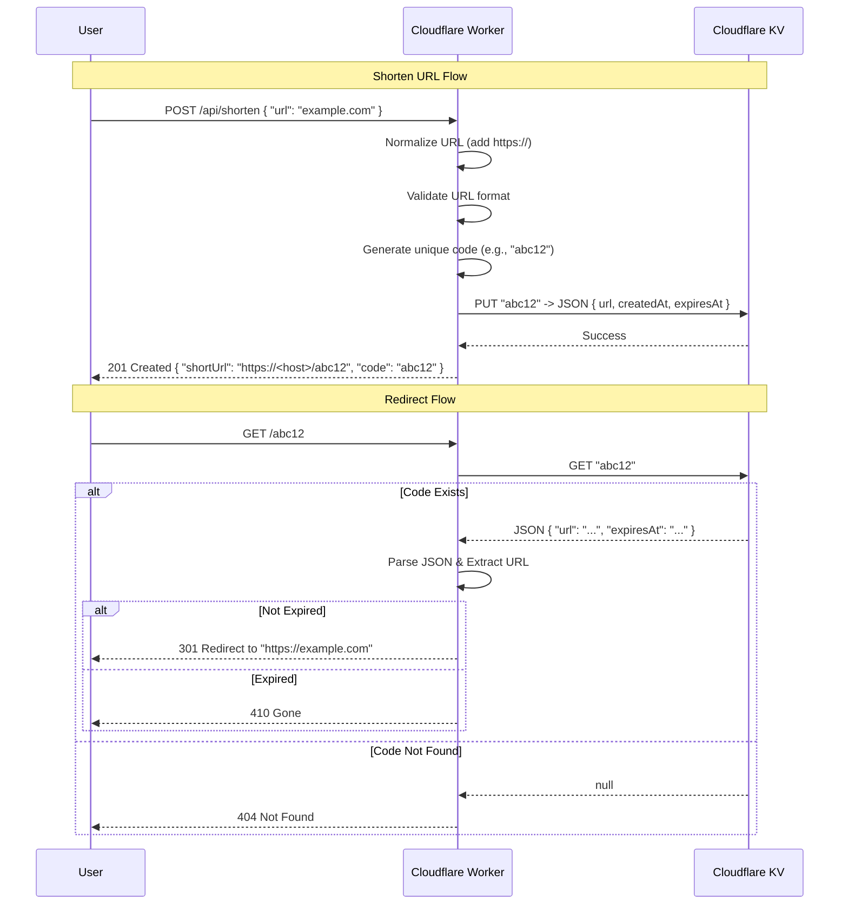

# Architecture: Short URL Generator

This document outlines the architecture for the serverless Short URL Generator, built on the Cloudflare Workers platform.

## Overview

The system is designed to be a high-performance, low-latency URL shortener. It leverages Cloudflare's edge network to handle requests close to the user and uses Cloudflare KV (Key-Value) storage for fast lookups of short codes. The system includes a web interface and automatic URL expiration.

## Technology Stack

- **Runtime**: [Cloudflare Workers](https://workers.cloudflare.com/) (Serverless JavaScript/TypeScript)
- **Language**: TypeScript
- **Routing**: `itty-router` (Tiny, zero-dependency router)
- **Storage**: [Cloudflare KV](https://developers.cloudflare.com/kv/) (Global, low-latency key-value store)
- **Deployment**: `wrangler` CLI

## Project Structure

```
├── src/
│   ├── index.ts       # Main worker logic and routes
│   ├── html.ts        # Frontend web interface HTML
│   └── index.test.ts  # Unit tests
├── scripts/
│   ├── test-local-kv.sh    # KV testing script
│   └── local-test-curl.sh # curl-based testing
├── wrangler.toml      # Worker configuration
├── package.json       # Dependencies
└── tsconfig.json     # TypeScript configuration
```

## Components

### 1. The Worker (`src/index.ts`)
The core logic resides in a single Cloudflare Worker. It handles incoming HTTP requests, routes them to the appropriate handler, and manages interactions with the KV store.

### 2. Router
We use `itty-router` to handle API routes. It maps HTTP methods and paths to specific handler functions.

### 3. Frontend (`src/html.ts`)
A built-in web interface served at the root URL (`/`). Users can enter a URL to shorten directly from their browser.

### 4. KV Namespace (`SHORT_URLS`)
A distributed key-value store acting as the database.
- **Key**: The generated short code (e.g., `abc12`).
- **Value**: A JSON string containing the original URL and metadata:
  ```json
  {
    "url": "https://www.example.com",
    "createdAt": "2024-03-05T12:00:00.000Z",
    "expiresAt": "2024-03-06T12:00:00.000Z"
  }
  ```

## API Endpoints

### 1. GET /
Serves the frontend web interface.

### 2. POST /api/shorten
- **Method**: `POST`
- **Path**: `/api/shorten`
- **Body**: `{ "url": "https://example.com" }`
- **Process**:
    1.  Validates and parses the input JSON
    2.  Normalizes the URL (adds `https://` if missing)
    3.  Validates the URL format
    4.  Generates a unique short code
    5.  Calculates an expiration date (default: 24 hours)
    6.  Stores the mapping `code -> { url, createdAt, expiresAt }` in KV
    7.  Returns the constructed short URL

### 3. GET /:code
- **Method**: `GET`
- **Path**: `/:code`
- **Process**:
    1.  Extracts the `code` from the URL path
    2.  Queries the `SHORT_URLS` KV namespace for the code
    3.  If found:
        - Parses the value (handles legacy string values or new JSON format)
        - Checks if the URL has expired
        - Redirects (`301`) to the target URL
    4.  If not found: Returns a `404 Not Found`
    5.  If expired: Returns a `410 Gone`

## URL Processing

### Normalization
URLs are automatically normalized:
- If a URL doesn't start with `http://` or `https://`, `https://` is prepended
- URLs are trimmed for whitespace

### Expiration
- Default TTL: 24 hours from creation
- Stored as ISO 8601 timestamp in `expiresAt` field
- Checked on redirect; expired URLs return 410 Gone

## Sequence Diagram

The following diagram illustrates the main flows: creating a short URL and accessing a short URL.



## Future Improvements

- **Analytics**: Store click counts, referrers, and user agents in KV or a separate analytics engine (e.g., Cloudflare Analytics Engine).
- **Rate Limiting**: Add rate limiting to prevent abuse.
- **Custom Aliases**: Allow users to specify their own custom codes (e.g., `/mylink`).
- **Auth**: Add API key authentication for the shortening endpoint to prevent abuse.
